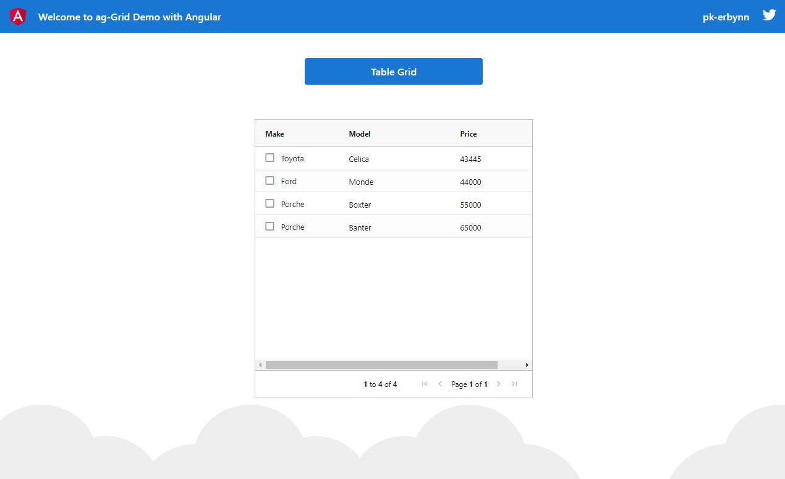
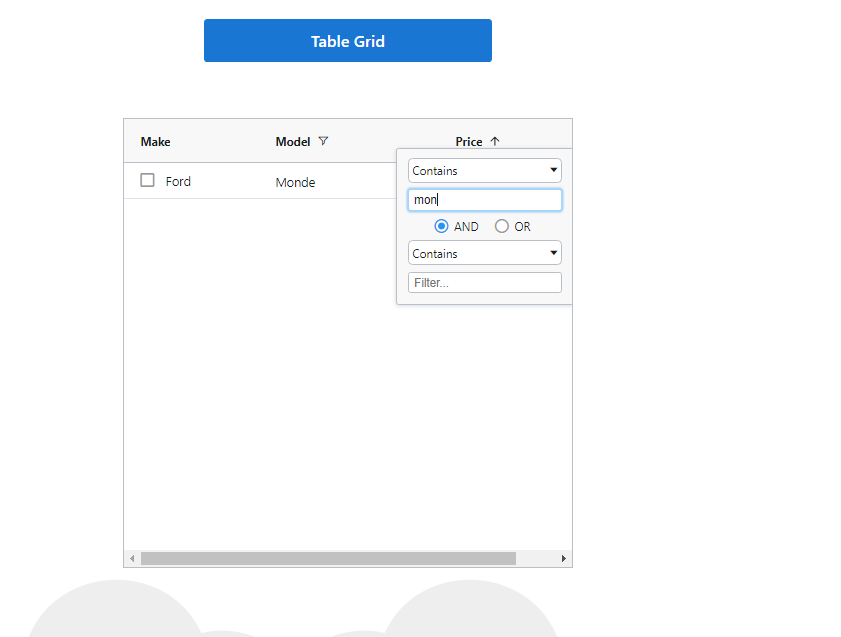

# agGridDemo

## Intro 
**agGrid** is a fully-fledged and highly customizable JavaScript data grid. It delivers outstanding features (like sorting, filtering, etc), performance, and rich data display (simple and complex). Interestingly, it also gives a smooth integration with Angular as well.

Why leverage on ag-Grid:
- [x] Column Grouping
- [x] Column Moving
- [x] Column Pinning
- [x] Column Resizing
- [x] Column and Text Filtering
- [x] Row Selection
- [x] Row Sorting
- [x] Row Dragging
- [x] Cell Styling
- [x] Touch Support and
- [x] Many more...

This demo is a play-around to exploring the nitty-gritty of this agGrid.

This project was generated with [Angular CLI](https://github.com/angular/angular-cli) version 11.1.2.

## Setup

1. Clone this repository

  ```sh
  $ git clone https://github.com/pkErbynn/ag-Grid-with-Angular.git
  ```

2. Navigate into the directory

  ```sh
  $ cd /ag-Grid-with-Angular
  ```

3. Run `ng serve` for a dev server. Navigate to `http://localhost:4200/`.

4. Enjoy :+1:


## Non-filter Result



## Filter Result




**NOTE:** Can switch _branches_ to see other use cases... :-)

- [Grouping](https://github.com/pkErbynn/ag-Grid-with-Angular/blob/grouping-grid/README.md#grouping-result)

- [Custom Cell Renderer (in dark mode)](https://github.com/pkErbynn/ag-Grid-with-Angular/tree/cell-renderer#cell-renderer-framework-result-dark-mode)


> [Find more on ag-Grid documentation here](https://www.ag-grid.com/documentation/angular/)
