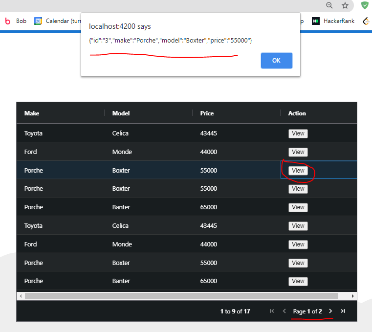

# agGridDemo
Demo of cellRendererFramework for column customization 

This project was generated with [Angular CLI](https://github.com/angular/angular-cli) version 11.1.2.

## Development server

Run `ng serve` for a dev server. Navigate to `http://localhost:4200/`. 

## Cell Button Renderer Result (dark mode)

